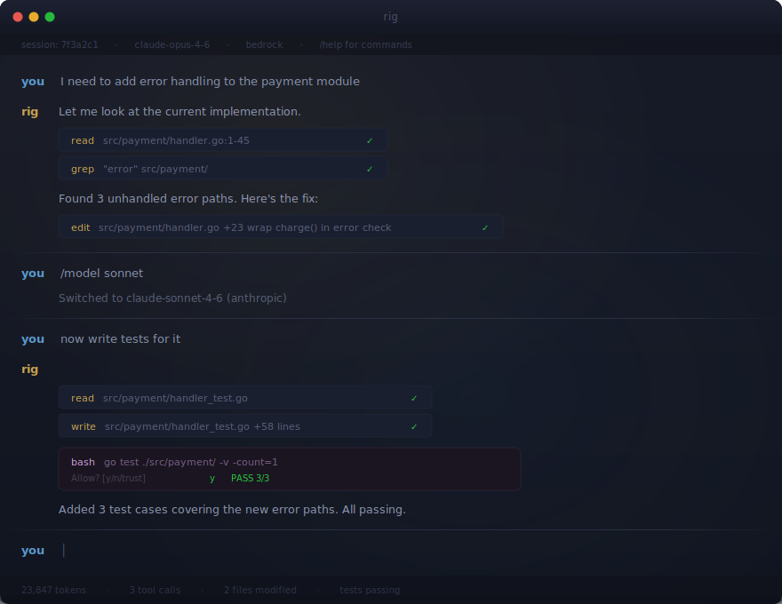

<p align="center">
  
</p>

<p align="center">
  <b>A coding agent that runs anywhere, connects to everything, and gets out of your way.</b>
</p>

<p align="center">
  
</p>

```
curl -fsSL https://raw.githubusercontent.com/SrihariLegend/rig/main/install.sh | sh
rig auth
rig
```

<br>

<p align="center">
  
</p>

<br>

## Why Rig

The current generation of AI coding tools ships as Electron apps, Python packages, or Node.js services. Hundreds of megabytes of runtime, version conflicts, locked to one provider.

Rig takes a different position:

| | |
|---|---|
| **Single binary** | No Python. No Node. No Docker. Copy it, run it. |
| **Any provider** | Anthropic, OpenAI, Google, Bedrock, Mistral, DeepSeek, xAI, Groq, OpenRouter. Same interface, switch with a flag. |
| **Fast** | Compiled C. Starts in under a millisecond. Memory in kilobytes. |
| **Extensible** | Lua extensions with 8 primitives. No SDK, no build step, drop a file. |
| **Yours** | An engine, not a product. Build editor plugins, CI agents, internal tools on top. |

```
$ time rig -p "What is 2+2?"
4

real    0m0.8s   # that's network latency, not startup time
```

## 7 Built-in Tools

| Tool | Purpose |
|------|---------|
| `bash` | Shell commands with timeout and output capture |
| `read` | Files with line numbers, offsets, and limits |
| `write` | Create or overwrite files |
| `edit` | Find-and-replace edits |
| `grep` | Regex search across files |
| `ls` | Directory contents |
| `introspect` | Query rig's own state (tools, config, extensions) |

Every tool has a permission system. Rig asks before writing or running commands. Trust rules configurable per tool, per path.

## Providers

| Provider | Models | Auth |
|----------|--------|------|
| Anthropic | Claude Opus 4.7, Opus 4.6, Sonnet 4.6, Haiku 4.5 | API key |
| OpenAI | GPT-4o | API key |
| Google | Via model registry | API key |
| AWS Bedrock | Claude Opus 4.6, Sonnet 4.5, Haiku 4.5 | AWS credentials |
| Mistral | Via model registry | API key |

Plus DeepSeek, xAI, Groq, OpenRouter. Switch models mid-conversation with `/model`.

## Terminal UI

The TUI uses a spatial lighting model. Each character gets its own brightness based on distance from the cursor, fading from warm to cool.

- **Lantern rendering** with per-character depth coloring
- **Markdown** rendered inline: code blocks, bold, italic, lists, headings
- **Scrollback** via mouse wheel, Page Up/Down, vim keys
- **Themes** as JSON color schemes with hot reload
- **Responsive** layout that adapts to terminal width

## Sessions and Modes

Conversations persist automatically. Resume with `rig --session <id>` or browse interactively with `/sessions`. Fork conversations with `/fork`.

| Mode | Invocation | Use |
|------|-----------|-----|
| Interactive | `rig` | Full TUI |
| Print | `rig -p "prompt"` | Stdout, pipe friendly |
| JSON | `rig --json -p "prompt"` | Structured output for scripts |
| RPC | Internal | Editor/tool integration |

## Lua Extensions

8 primitives, mathematically proven to be the minimal complete set for unbounded extensibility:

```lua
rig.exec(cmd)            -- run a shell command
rig.completion(params)   -- call any LLM
rig.print(text)          -- output to the TUI
rig.input(prompt)        -- read user input
rig.hook(event, fn)      -- react to events
rig.unhook(handle)       -- remove a hook
rig.get(ns, key)         -- read state
rig.set(ns, key, val)    -- write state
```

Drop a `.lua` file in `.rig/extensions/` and it loads on startup. No framework, no build step.

### Custom slash command

```lua
rig.set("commands", "deploy", function(args)
    local r = rig.exec("git push origin main")
    rig.print(r.ok and "deployed" or "failed: " .. r.stdout)
end)
```

### Custom tool the LLM can call

```lua
rig.set("tools", "weather", {
    description = "Get weather for a city",
    params = { city = { type = "string", description = "City name" } },
    run = function(p)
        local r = rig.exec("curl -s 'wttr.in/" .. p.city .. "?format=3'")
        return r.stdout
    end
})
```

### System prompt injection

```lua
local r = rig.exec("cat README.md | head -20")
if r.ok then
    rig.set("prompts", "context", "Project README:\n" .. r.stdout)
end
```

Full documentation: [`docs/extensions.md`](docs/extensions.md)

## Architecture

```
┌─────────────────────────────────────────────────┐
│                     rig                          │
│                  (566KB binary)                  │
├──────────────┬────────────┬─────────────────────┤
│   rig-ai     │  rig-agent │    rig-harness      │
│  providers   │    loop    │   tools, sessions   │
│  streaming   │    tool    │   permissions       │
│  transform   │   dispatch │   extensions        │
├──────────────┴────────────┴─────────────────────┤
│                   rig-tui                        │
│      lantern · markdown · scrollback            │
├─────────────────────────────────────────────────┤
│               Lua extensions                     │
│          8 primitives · sandboxed               │
└─────────────────────────────────────────────────┘
```

```
src/
├── ai/            LLM providers (Anthropic, OpenAI, Google, Bedrock, Mistral)
├── agent/         Agent loop: stream, tool calls, execute, repeat
├── harness/       CLI harness: auth, sessions, tools, permissions, extensions
│   ├── tools/     Built-in tools (bash, read, write, edit, grep, ls, introspect)
│   ├── modes/     Interactive, print, RPC
│   └── extensions/  Hook system, event bus, Lua bridge
├── tui/           Terminal UI: lantern renderer, markdown, keyboard, scrollback
└── util/          Arena allocator, strings, hashmap, HTTP, JSON, process
```

23K lines of C. No generated code.

## Install

```bash
curl -fsSL https://raw.githubusercontent.com/SrihariLegend/rig/main/install.sh | sh
```

Downloads a prebuilt binary for your platform (Linux amd64/arm64, macOS arm64), verifies checksum, installs to `/usr/local/bin`.

### From source

```bash
git clone https://github.com/SrihariLegend/rig.git
cd rig
make
sudo make install
rig auth
rig
```

Needs a C11 compiler, libcurl, libssl (OpenSSL), zlib. The build vendors Lua 5.4, cJSON, libyaml, and md4c.

## Docs

| | |
|---|---|
| [`docs/extensions.md`](docs/extensions.md) | Lua extensions: 8 primitives, namespaces, sandbox |
| [`docs/configuration.md`](docs/configuration.md) | Settings, permissions, trust rules, directory layout |
| [`docs/sessions.md`](docs/sessions.md) | Session persistence, branching, context reconstruction |
| [`docs/workflows.md`](docs/workflows.md) | YAML/JSON workflow engine, 16 step types |
| [`docs/themes.md`](docs/themes.md) | Theme format, 51 color tokens |
| [`docs/prompts.md`](docs/prompts.md) | Prompt templates, variable substitution |

## Contributing

```bash
make          # build
make test     # run tests
make clean    # clean
```

## License

MIT
