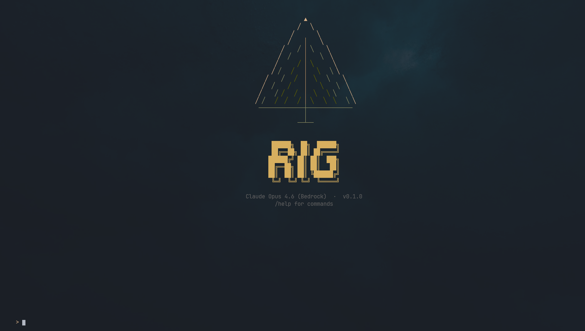

# Rig

<p align="center">
  
</p>

A coding agent that runs anywhere, connects to everything, and gets out of your way.

**~23K lines of C. ~600KB binary. Zero runtime dependencies. Every major LLM provider. Extensible via Lua.**

Rig is a coding agent written in C. One binary, no runtime deps, works with every major LLM provider.

```
curl -fsSL https://raw.githubusercontent.com/SrihariLegend/rig/main/install.sh | sh
rig auth
rig
```

---

## Why Rig

The current generation of AI coding tools ships as Electron apps, Python packages, or Node.js services. They bundle hundreds of megabytes of runtime, break on version conflicts, and lock you into one provider.

Rig takes a different position:

- **Single binary.** No Python. No Node. No Docker. No runtime. Copy it, run it.
- **Any provider.** Anthropic, OpenAI, Google, Bedrock, Mistral. Same interface, same tools, switch with a flag.
- **Fast.** Compiled C. Starts in under a millisecond. Memory measured in kilobytes, not gigabytes.
- **Extensible.** Lua extensions with 8 primitives that cover every possible integration. No SDK to install, no build step.
- **Infrastructure, not product.** Rig is an engine. Build your own AI coding experience on top: editor plugins, CI pipelines, custom agents, internal tools.

```
$ time rig -p "What is 2+2?"
4

real    0m0.8s   # that's network latency, not startup time
```

## Features

### Multi-Provider LLM Support

Connect to any major provider with a single auth flow:

| Provider | Built-in Models | Auth |
|----------|----------------|------|
| Anthropic | Claude Opus 4.7, Opus 4.6, Sonnet 4.6, Haiku 4.5 | API key |
| OpenAI | GPT-4o | API key |
| Google | Via model registry | API key |
| AWS Bedrock | Claude Opus 4.6, Sonnet 4.5, Haiku 4.5 | AWS credentials |
| Mistral | Via model registry | API key |

Additional providers: DeepSeek, xAI, Groq, OpenRouter. Run `rig auth` to configure.

Switch models mid-conversation with `/model`. No restart, no config file.

### Built-in Tools

The agent ships with 6 tools that cover the full coding workflow:

| Tool | Purpose |
|------|---------|
| `bash` | Execute shell commands with timeout and output capture |
| `read` | Read files with line numbers, offsets, and limits |
| `write` | Create or overwrite files |
| `edit` | Surgical find-and-replace edits |
| `grep` | Regex search across files |
| `introspect` | Query Rig's own state (tools, config, extensions) |

Every tool has a permission system. Rig asks before writing to disk or running commands. Trust rules are configurable per tool, per path.

### Terminal UI

A full TUI with an amber-toned viewport renderer:

- **Viewport rendering:** warm amber palette with true-color output, left-aligned layout
- **Markdown rendering:** code blocks, bold, italic, lists, headings, rendered inline
- **Scrollback:** scroll through conversation history with mouse wheel, Page Up/Down, or vim keys
- **Tool breathing:** non-tool content dims during tool execution for visual focus
- **Spinner:** visual feedback during tool execution and streaming
- **Responsive:** handles terminal resize, adapts layout to width

### Sessions

Conversations persist automatically. Resume any session:

```
rig --session abc123
```

Or browse and pick interactively with `/sessions`.

### Four Modes

| Mode | Use Case | Invocation |
|------|----------|------------|
| **Interactive** | TUI conversation | `rig` |
| **Print** | One off, stdout | `rig -p "prompt"` |
| **JSON** | Structured event output | `rig --json -p "prompt"` |
| **RPC** | Editor/tool integration | Internal |

Works with pipes. Script it, embed it, build on it.

---

## Lua Extensions

Rig exposes **8 primitives** to Lua, mathematically proven to be the minimal complete set for unbounded extensibility:

| Primitive | What it does |
|-----------|-------------|
| `rig.exec(cmd)` | Run a shell command |
| `rig.completion(params)` | Call any LLM |
| `rig.print(text)` | Output to the TUI |
| `rig.input(prompt)` | Read user input |
| `rig.hook(event, fn)` | React to events |
| `rig.unhook(handle)` | Remove a hook |
| `rig.get(ns, key)` | Read state |
| `rig.set(ns, key, val)` | Write state |

That's it. No framework. No build step. No dependency graph. Drop a `.lua` file in `.rig/extensions/` and it loads on startup.

### Example: Custom Slash Command

```lua
rig.set("commands", "deploy", function(args)
    local r = rig.exec("git push origin main")
    rig.print(r.ok and "deployed ✓" or "deploy failed: " .. r.stdout)
end)
```

### Example: Custom Tool for the LLM

```lua
rig.set("tools", "weather", {
    description = "Get weather for a city",
    params = { city = { type = "string", description = "City name" } },
    run = function(p)
        local r = rig.exec("curl -s 'wttr.in/" .. p.city .. "?format=3'")
        return r.stdout
    end
})
```

### Example: System Prompt Injection

```lua
local r = rig.exec("cat README.md | head -20")
if r.ok then
    rig.set("prompts", "context", "Project README:\n" .. r.stdout)
end
```

Full documentation: [`docs/extensions.md`](docs/extensions.md)

---

## Documentation

| Document | What it covers |
|----------|---------------|
| [`docs/extensions.md`](docs/extensions.md) | Writing Lua extensions: the 8 primitives, namespaces, sandbox, examples |
| [`docs/configuration.md`](docs/configuration.md) | Settings layers, permissions, trust rules, directory layout |
| [`docs/sessions.md`](docs/sessions.md) | Session persistence, branching, context reconstruction |
| [`docs/workflows.md`](docs/workflows.md) | YAML/JSON workflow engine: 16 step types, expressions, parallel execution |
| [`docs/themes.md`](docs/themes.md) | Theme format: variables, 51 color tokens, examples |
| [`docs/prompts.md`](docs/prompts.md) | Prompt templates: frontmatter, variable substitution syntax |

---

## Install

### Quick Install

```bash
curl -fsSL https://raw.githubusercontent.com/SrihariLegend/rig/main/install.sh | sh
```

Downloads prebuilt binary for your platform (Linux amd64/arm64, macOS amd64/arm64), verifies checksum, installs to `/usr/local/bin`.

Pin a version: `RIG_VERSION=v0.1.0 sh -c "$(curl -fsSL ...)"`. Custom path: `RIG_INSTALL_DIR=~/.local/bin`.

### From Source

Requires: a C11 compiler, `libcurl`, `libssl` (OpenSSL), `zlib`. That's it.

```bash
git clone https://github.com/SrihariLegend/rig.git
cd rig
make
sudo make install   # installs to /usr/local/bin
rig auth
rig
```

The build vendors its own Lua 5.4, cJSON, libyaml, and md4c. No package manager needed.

### Dependencies

**Build time:** C compiler, libcurl-dev, libssl-dev, zlib-dev

**Runtime:** libcurl, libssl, zlib (present on virtually every Linux system)

**Vendored (zero install):** Lua 5.4, cJSON, libyaml, md4c

---

## Architecture

```
┌─────────────────────────────────────────────┐
│                    rig                       │
│                 (566KB binary)               │
├─────────────┬───────────┬───────────────────┤
│   rig-ai    │ rig-agent │   rig-harness     │
│  providers  │   loop    │  tools, sessions  │
│  streaming  │  tool     │  permissions      │
│  transform  │  dispatch │  extensions       │
├─────────────┴───────────┴───────────────────┤
│                  rig-tui                     │
│    viewport · markdown · scrollback         │
├─────────────────────────────────────────────┤
│              Lua extensions                  │
│         8 primitives · sandboxed            │
└─────────────────────────────────────────────┘
```

Everything is in `src/`:

```
src/
├── ai/           # LLM provider abstraction (Anthropic, OpenAI, Google, Bedrock, Mistral)
├── agent/        # Agent loop: stream → tool calls → execute → repeat
├── harness/      # CLI harness: auth, sessions, tools, permissions, extensions
│   ├── tools/    # Built-in tools (bash, read, write, edit, grep, introspect)
│   ├── modes/    # Interactive, print, RPC
│   └── extensions/ # Hook system, event bus, Lua bridge
├── tui/          # Terminal UI: viewport renderer, markdown, keyboard, scrollback
└── util/         # Arena allocator, strings, hashmap, HTTP, JSON, process
```

23K lines of C. No generated code. No abstraction astronautics.

---

## Vision

AI coding tools should be infrastructure, not products.

Rig is the engine. The universal layer between LLM providers and whatever you want to build:

- **Editor plugins** that don't ship their own runtime
- **CI/CD agents** that run in containers without installing Node
- **Internal tools** that connect to your company's LLM endpoint
- **Custom agents** with tools and workflows specific to your domain
- **Community extensions** that install with a single file copy

The binary is the platform. Lua is the extension language. The protocol is simple. Build whatever you want.

---

## Contributing

```bash
make          # build
make test     # run tests
make clean    # clean build artifacts
```

The codebase is intentionally small and readable. Every subsystem fits in your head.

---

## License

MIT
