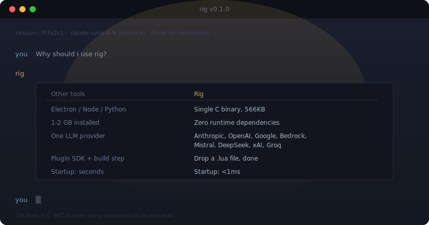
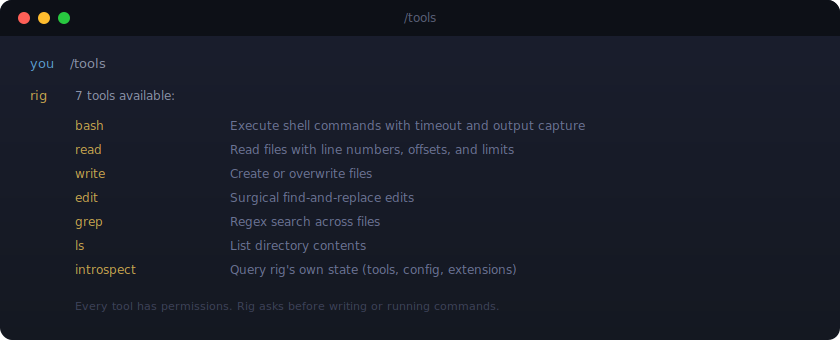
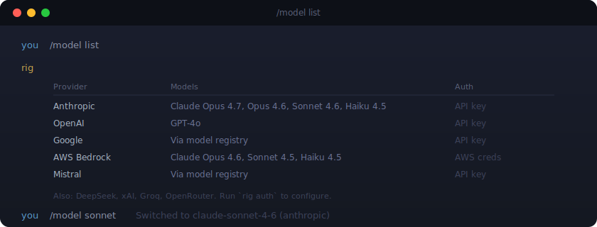
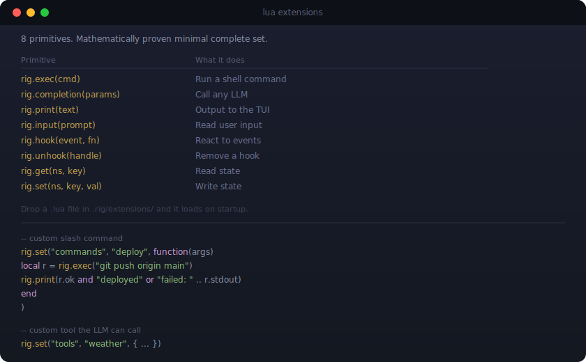
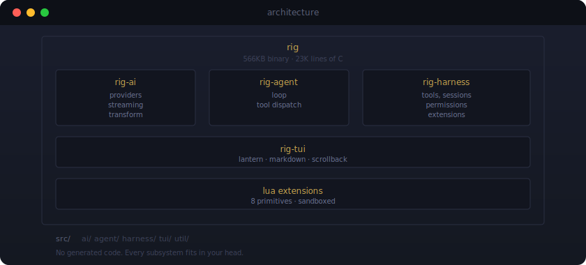
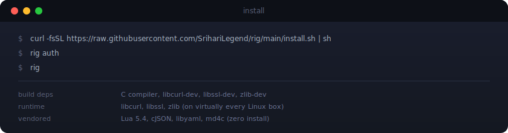

<p align="center">
  
</p>

<p align="center">
  
</p>

## Tools

<p align="center">
  
</p>

## Providers

<p align="center">
  
</p>

## Terminal UI

A TUI with spatial lighting, not plain colored text:

- **Lantern rendering** - warm to cool color gradient that fades with distance from the cursor
- **Markdown rendering** - code blocks, bold, italic, lists, headings, rendered inline
- **Scrollback** - mouse wheel, Page Up/Down, vim keys
- **Themes** - JSON color schemes with hot reload via `/theme`
- **Responsive** - handles terminal resize, adapts to width

## Sessions

Conversations persist automatically. Resume with `rig --session <id>` or browse with `/sessions`.

## Modes

| Mode | Invocation | Use |
|------|-----------|-----|
| Interactive | `rig` | Full TUI |
| Print | `rig -p "prompt"` | One off, stdout |
| JSON | `rig --json -p "prompt"` | Structured output |
| RPC | Internal | Editor integration |

Works with pipes, redirects, and jq.

## Lua Extensions

<p align="center">
  
</p>

Full documentation: [`docs/extensions.md`](docs/extensions.md)

## Architecture

<p align="center">
  
</p>

## Install

<p align="center">
  
</p>

Or build from source:

```bash
git clone https://github.com/SrihariLegend/rig.git
cd rig && make && sudo make install
```

## Docs

| | |
|---|---|
| [`extensions.md`](docs/extensions.md) | 8 Lua primitives, namespaces, sandbox |
| [`configuration.md`](docs/configuration.md) | Settings, permissions, trust rules |
| [`sessions.md`](docs/sessions.md) | Persistence, branching, context reconstruction |
| [`workflows.md`](docs/workflows.md) | YAML/JSON workflow engine, 16 step types |
| [`themes.md`](docs/themes.md) | Theme format, 51 color tokens |
| [`prompts.md`](docs/prompts.md) | Prompt templates, variable substitution |

## Contributing

```bash
make          # build
make test     # run tests
make clean    # clean
```

## License

MIT
